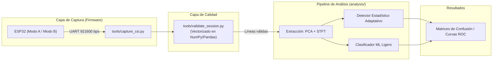

# 📡👻 Sensado de Presencia mediante WiFi CSI (a través de paredes, sin cámara)


> Detección de presencia y movimiento humano mediante el análisis de la información del estado del canal (*Channel State Information* - CSI) en redes WiFi 802.11n/ac sobre placas ESP32. Sin sensores dedicados, cámaras ni micrófonos: únicamente procesando las perturbaciones electromagnéticas en la banda de 2.4 GHz.

Proyecto de investigación aplicada en sensado RF y procesamiento digital de señal, integrado en el portfolio de Ingeniería de Telecomunicaciones. Repositorio principal: [Telecom-portfolio](https://github.com/AlvGJ-UGR/Telecom-portfolio).

📄 **Página del proyecto (panel de estado en vivo y documentación):** [Ver sitio web](https://AlvGJ-UGR.github.io/wifi-csi-presence-sensing/)

---

## Tabla de Contenidos

1. [Motivación](#motivación)
2. [Fundamento Técnico](#fundamento-técnico)
3. [Trabajo Relacionado y Diferenciación](#trabajo-relacionado-y-diferenciación)
4. [Arquitectura del Sistema](#arquitectura-del-sistema)
5. [Hardware y Entorno de Pruebas](#hardware-y-entorno-de-pruebas)
6. [Metodología de Validación de Datos](#metodología-de-validación-de-datos)
7. [Roadmap y Fases](#roadmap-y-fases)
8. [Guía Rápida de Inicio (Quickstart)](#guía-rápida-de-inicio-quickstart)
9. [Estructura del Repositorio](#estructura-del-repositorio)
10. [Limitaciones Técnicas](#limitaciones-técnicas)
11. [Ética y Consentimiento](#ética-y-consentimiento)
12. [Referencias](#referencias)
13. [Contacto y Licencia](#contacto-y-licencia)

---

## Motivación

Un emisor WiFi inunda el espacio con ondas electromagnéticas en la banda de 2.4 GHz. Cuando una persona interactúa en el entorno, perturba el patrón de la onda debido a fenómenos de absorción, reflexión y dispersión.

La matriz **CSI ($H(f, t)$)** extrae los valores de amplitud y fase por cada subportadora OFDM en la capa física. El propósito de este proyecto es implementar un pipeline transparente de procesamiento de señal e ingeniería de características para la clasificación de presencia humana (estática y dinámica) frente a escenarios ausentes, validando experimentalmente los límites físicos del canal frente a atenuaciones por paredes de carga y tabiques.

---

## Fundamento Técnico

En un sistema WiFi 802.11n/ac basado en multiplexación por división de frecuencias ortogonales (OFDM), la relación entre el símbolo transmitido $X(f, t)$ y el recibido $Y(f, t)$ se modela como:

$$Y(f, t) = H(f, t) \cdot X(f, t) + N(f, t)$$

Donde $H(f, t)$ representa la matriz compleja de CSI para cada subportadora $k$, codificando el desvanecimiento por multicamino (*multipath fading*):

$$H_k = |H_k| e^{j \angle H_k}$$

Las variaciones en la envolvente de la amplitud $|H_k|$ y la estabilidad de la fase $\angle H_k$ a lo largo del tiempo constituyen la firma espectral utilizada por el sistema de sensado.

---

## Trabajo Relacionado y Diferenciación

| Proyecto | Tipo | Enfoque | Diferenciación de este proyecto |
|---|---|---|---|
| [`espressif/esp-csi`](https://github.com/espressif/esp-csi) | Framework | Captura raw y demostraciones | Utilizado como capa firmware básica; añadimos pipeline de análisis estadístico y validación |
| [`francescopace/espectre`](https://github.com/francescopace/espectre) | Aplicación | Integración Home Assistant | Este proyecto publica la caracterización RF interna, datos crudos, matrices de confusión y métricas exactas |
| [`StevenMHernandez/ESP32-CSI-Tool`](https://github.com/StevenMHernandez/ESP32-CSI-Tool) | Tooling | Extracción de tramas | Añade la capa superior de extracción de características y modelos de decisión |
| Modelos Deep Learning (CNN/LSTM) | Investigación | Redes complejas | Preferimos un enfoque clásico explicable (PCA + varianza de energía en $f < 5\text{ Hz}$) apto para sistemas embebidos |

---

## Arquitectura del Sistema


---

## Hardware y Entorno de Pruebas

* **Nodos Transmisor/Receptor:** 2x ESP32-WROOM-32D.
* **Tasa de baudios de adquisición:** 921,600 bps (UART sin control de flujo hardware).
* **Escenario de prueba principal:** Salón libre de obstáculos cercanos para mantener limpia la primera Zona de Fresnel, evaluando escenarios `ausente`, `presente_estatico` y `presente_movimiento`.

---

## Metodología de Validación de Datos

Debido a la alta tasa de datos en la interfaz UART, las pérdidas de paquetes pueden inducir tramas corruptas. Se ha integrado un validador vectorial (`tools/validate_session.py`) que audita cada captura bajo los siguientes criterios:

* **Tasa de corrupción ($P_{\text{loss}}$) $< 5\%$:** Estado `OK`.
* **$5\% \le P_{\text{loss}} < 15\%$:** Estado `WARN` (Filtrado automático de líneas).
* **$P_{\text{loss}} \ge 15\%$:** Estado `FAIL` (Sesión descartada).

---

 ## Roadmap y Fases

- [x] **Fase 0 — Preparación del Repositorio:** Estructura, políticas ADR y entorno.
- [x] **Fase 1 — Adquisición e Infraestructura CSI:** Firmware flasheado, flujo UART a 921.6k baudios configurado y script de validación vectorial activo. *(Capturas iniciales completadas en Modo A).*
- [ ] **Fase 2 — Caracterización de la Señal:** Análisis espectral, filtrado de ruido de alta frecuencia y estudio de amplitud/fase por subportadora en `analysis/`.
- [ ] **Fase 3 — Generación del Dataset:** Protocolo de recolección sistemático en múltiples recintos.
- [ ] **Fase 4 — Detector Baseline (Clásico):** Algoritmo por varianza adaptativa sobre componentes principales.
- [ ] **Fase 5 — Ingeniería de Características:** Reducción de dimensionalidad vía PCA y cálculo de densidad espectral de potencia (STFT).
- [ ] **Fase 6 — Machine Learning Evaluado:** Clasificadores kNN/SVM ligeros en comparación directa contra el Baseline.
- [ ] **Fase 7 — Caracterización de Atenuación RF:** Evaluación de desempeño frente a paredes y distancia.
- [ ] **Fase 8 — Integración y Visualización:** Dashboard en tiempo real.
- [ ] **Fase 9 — Documentación Final.** 

  ---

## Guía Rápida de Inicio (Quickstart)

### 1. Clonar el repositorio e instalar dependencias
```bash
git clone [https://github.com/AlvGJ-UGR/wifi-csi-presence-sensing.git](https://github.com/AlvGJ-UGR/wifi-csi-presence-sensing.git)
cd wifi-csi-presence-sensing
python -m venv venv
source venv/bin/activate  # En Windows: venv\Scripts\activate
pip install -r requirements.txt
```
---
### Paso 2: Validar Sesión de Captura

```markdown
### 2. Validar una sesión de captura existente

```bash
python tools/validate_session.py data/raw/ausente/
```
---
### Paso 3: Ejecutar Pruebas Unitarias

```markdown
### 3. Ejecutar la suite de pruebas

```bash
pytest tools/tests/
```
---

## Estructura del Repositorio
wifi-csi-presence-sensing/
├── README.md                 <- Este documento
├── requirements.txt          <- Dependencias del proyecto (Pandas, NumPy, Pytest, SciPy)
├── firmware/                 <- Proyecto de firmware ESP32 (basado en esp-csi)
├── tools/                    <- Scripts de adquisición y validación de calidad por serie
│   ├── capture_csi.py
│   ├── validate_session.py
│   └── tests/                <- Pruebas unitarias de la infraestructura
├── analysis/                 <- Pipeline de procesamiento de señal y ML
├── data/
│   ├── raw/                  <- Capturas crudas organizadas por sesión
│   └── labeled/              <- Datasets filtrados y estructurados
└── results/                  <- Gráficas de salida, curvas ROC y matrices de confusión

---
## Limitaciones Técnicas

* **Efectos térmicos:** Las derivas de temperatura en el cristal oscilador del ESP32 inducen desviaciones en la fase de la subportadora, requiriendo filtrado previo.
* **Geometría del recinto:** Los modelos entrenados en entornos de multitrayecto denso requieren recalibración de la línea de base del estado ausente.

---
## Ética y Consentimiento

* **Consentimiento por sesión:** Todas las capturas con presencia humana requieren registro en `metadata.json`.
* **Anonimización:** Los datos se asocian a identificadores anónimos (`P01`, `P02`).

---
## Contacto y Licencia

* **Autor:** Álvaro Gómez — [GitHub](https://github.com/AlvGJ-UGR) | [LinkedIn]()
* **Email:** alvarogj1@correo.ugr.es
* **Licencia:** Distribuido bajo la licencia MIT. Consulta `LICENSE` para más información.


    
