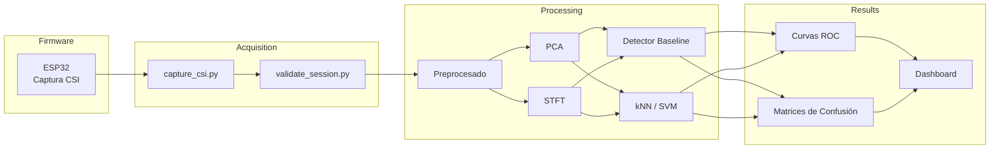

<h1 align="center">📡 WiFi CSI Presence Sensing</h1>

<p align="center">
  <strong>Detección de presencia humana mediante Channel State Information (CSI) utilizando ESP32</strong>
</p>

<p align="center">
  Sin cámaras • Sin micrófonos • Sin sensores dedicados
</p>

<p align="center">


</p>

---

> **WiFi CSI Presence Sensing** investiga el uso de la **Channel State Information (CSI)** de redes WiFi IEEE 802.11n para detectar presencia y movimiento humano a través del análisis de las perturbaciones electromagnéticas del canal de radio, sin necesidad de emplear cámaras, sensores PIR, radares o micrófonos.

El proyecto forma parte de mi **portfolio de Ingeniería de Tecnologías de Telecomunicación** y tiene como objetivo desarrollar un pipeline completo de adquisición, validación, procesamiento y clasificación de datos CSI utilizando placas **ESP32**.

## 🎯 Objetivos

- Implementar un sistema de adquisición de datos CSI mediante ESP32.
- Caracterizar experimentalmente la respuesta del canal WiFi frente a la presencia humana.
- Diseñar un pipeline reproducible de procesamiento digital de señal.
- Comparar detectores estadísticos clásicos con modelos ligeros de Machine Learning.
- Evaluar el rendimiento en escenarios reales, incluyendo detección a través de paredes.

---

## 🌐 Documentación

📄 **Sitio web del proyecto**

> https://AlvGJ-UGR.github.io/wifi-csi-presence-sensing/

Incluye:

- Estado actual del proyecto.
- Documentación técnica.
- Roadmap.
- Resultados experimentales.
- Referencias bibliográficas.

---

## 📚 Contenido

- [Motivación](#-motivación)
- [Fundamento técnico](#-fundamento-técnico)
- [Trabajo relacionado](#-trabajo-relacionado)
- [Arquitectura del sistema](#-arquitectura-del-sistema)
- [Hardware y entorno de pruebas](#-hardware-y-entorno-de-pruebas)
- [Metodología de validación](#-metodología-de-validación-de-datos)
- [Roadmap](#-roadmap)
- [Quickstart](#-quickstart)
- [Estructura del repositorio](#-estructura-del-repositorio)
- [Limitaciones](#-limitaciones-técnicas)
- [Ética](#-ética-y-consentimiento)
- [Licencia](#-contacto-y-licencia)

---

## ✨ Características

- 📡 Captura de **Channel State Information (CSI)** utilizando ESP32.
- ⚡ Adquisición de datos a **921 600 baudios** mediante UART.
- 📊 Validación automática de sesiones de captura.
- 📈 Pipeline reproducible de procesamiento de señal.
- 🧠 Comparativa entre detectores estadísticos y Machine Learning.
- 🏠 Evaluación en entornos interiores con y sin obstáculos.
- 📚 Proyecto completamente documentado y reproducible.

---
## 🎯 Motivación

Las redes WiFi no solo transportan información: también proporcionan una representación del entorno físico a través del comportamiento del canal radioeléctrico.

Cuando una persona se mueve o permanece en un recinto, modifica la propagación de las ondas electromagnéticas mediante fenómenos de **reflexión**, **absorción**, **difracción** y **dispersión**. Estas variaciones alteran la respuesta del canal y pueden medirse sin necesidad de instalar sensores adicionales.

La **Channel State Information (CSI)** ofrece una descripción mucho más detallada del canal que el indicador tradicional **RSSI**, ya que proporciona información compleja (amplitud y fase) para cada subportadora OFDM.

El objetivo de este proyecto es aprovechar esa información para construir un sistema capaz de distinguir entre escenarios de:

- Ausencia de personas.
- Presencia estática.
- Presencia con movimiento.

Todo ello utilizando exclusivamente hardware WiFi comercial basado en **ESP32**, desarrollando un pipeline completamente reproducible de adquisición, validación, procesamiento y clasificación de datos.

Además del desarrollo del detector, el proyecto busca estudiar experimentalmente los límites físicos del sensado RF, analizando el efecto de factores como:

- Distancia entre transmisor y receptor.
- Atenuación producida por paredes y obstáculos.
- Ruido electromagnético.
- Estabilidad temporal del canal.
- Variabilidad entre distintos entornos interiores.

---

# 📖 Fundamento Técnico

## Channel State Information (CSI)

En sistemas IEEE 802.11n/ac basados en **OFDM (Orthogonal Frequency Division Multiplexing)**, cada paquete recibido contiene información sobre el estado del canal radioeléctrico para cada subportadora utilizada durante la transmisión.

Matemáticamente, la señal recibida puede modelarse como:

```
Y(f,t) = H(f,t) · X(f,t) + N(f,t)
```

donde:

| Símbolo | Descripción |
|----------|-------------|
| **X(f,t)** | Símbolo transmitido |
| **Y(f,t)** | Símbolo recibido |
| **H(f,t)** | Respuesta compleja del canal (CSI) |
| **N(f,t)** | Ruido aditivo |

El término **H(f,t)** representa la respuesta compleja del canal para cada subportadora y contiene información tanto de amplitud como de fase.

Cada subportadora puede expresarse como:

```
Hₖ = |Hₖ| · e^(j∠Hₖ)
```

donde:

- **|Hₖ|** representa la amplitud.
- **∠Hₖ** representa la fase.
- **j** es la unidad imaginaria.

Las pequeñas variaciones de estos parámetros a lo largo del tiempo constituyen la firma electromagnética que permite detectar la presencia de personas en el entorno.

---

## Propagación por multitrayecto

En interiores, la señal WiFi rara vez sigue un único camino entre transmisor y receptor.

Cada paquete recibido es la suma de múltiples trayectorias generadas por reflexiones en:

- Paredes.
- Suelo y techo.
- Mobiliario.
- Objetos metálicos.
- Personas.

Este fenómeno, conocido como **multipath propagation**, provoca interferencias constructivas y destructivas que modifican continuamente la respuesta del canal.

Cuando una persona cambia de posición, aparecen nuevas trayectorias y desaparecen otras, alterando la CSI incluso aunque la potencia RSSI permanezca prácticamente constante.

---

## ¿Por qué CSI y no RSSI?

Aunque el **RSSI** resulta útil para estimar la intensidad media de la señal, ofrece una única medida escalar por paquete.

La **CSI**, en cambio, proporciona información independiente para cada subportadora OFDM, permitiendo analizar variaciones mucho más sutiles del canal.

| RSSI | CSI |
|------|-----|
| Una única medida por paquete | Decenas de subportadoras por paquete |
| Solo potencia | Amplitud y fase |
| Baja resolución espacial | Alta resolución espacial |
| Poco sensible a pequeños movimientos | Muy sensible al movimiento humano |
| Adecuado para cobertura | Adecuado para sensado RF |

Esta mayor resolución convierte la CSI en una herramienta especialmente adecuada para aplicaciones de **WiFi Sensing**, como:

- Detección de presencia.
- Reconocimiento de actividad humana.
- Monitorización de ocupación.
- Estimación de respiración y ritmo cardíaco (en sistemas avanzados).
- Localización indoor.

---

## Enfoque del proyecto

A diferencia de muchos trabajos recientes que emplean redes neuronales profundas desde las primeras etapas del procesamiento, este proyecto prioriza un enfoque **explicable y reproducible**.

El pipeline seguirá una arquitectura clásica:

1. Captura de CSI mediante ESP32.
2. Validación automática de calidad de los datos.
3. Filtrado y limpieza de la señal.
4. Extracción de características.
5. Reducción de dimensionalidad mediante PCA.
6. Detector estadístico de referencia (*baseline*).
7. Comparación con clasificadores ligeros (kNN y SVM).

Este enfoque facilita la interpretación física de los resultados, reduce los requisitos computacionales y resulta especialmente adecuado para sistemas embebidos con recursos limitados.

---
# 🔬 Trabajo Relacionado

El sensado mediante **WiFi CSI** es un área de investigación en rápido crecimiento, impulsada por la disponibilidad de hardware WiFi comercial capaz de exponer información de la capa física.

La mayoría de proyectos existentes se centran en uno de estos tres aspectos:

- Captura de datos CSI.
- Automatización del procesamiento.
- Aplicaciones finales (domótica, presencia, actividad humana).

Este proyecto busca integrar todas esas etapas en un flujo reproducible, documentado y orientado al aprendizaje, poniendo especial énfasis en la caracterización del canal y la interpretación de los resultados.

## Comparativa

| Proyecto | Tipo | Enfoque | Diferenciación |
|:---------|:----:|:--------|:---------------|
| [`espressif/esp-csi`](https://github.com/espressif/esp-csi) | Framework | Captura de CSI sobre ESP32 | Base firmware utilizada para la adquisición de datos. |
| [`StevenMHernandez/ESP32-CSI-Tool`](https://github.com/StevenMHernandez/ESP32-CSI-Tool) | Herramienta | Captura y exportación de tramas CSI | Este proyecto incorpora un pipeline completo de validación, análisis y clasificación. |
| [`francescopace/espectre`](https://github.com/francescopace/espectre) | Aplicación | Integración con Home Assistant | Aquí el objetivo principal es la caracterización física del canal y la evaluación cuantitativa del detector. |
| Modelos CNN/LSTM | Investigación | Clasificación mediante Deep Learning | Se prioriza un enfoque explicable basado en estadística clásica y Machine Learning ligero. |

---

## ¿Qué aporta este proyecto?

Más allá de detectar presencia, el objetivo es construir un laboratorio abierto para experimentar con **WiFi Sensing**, donde cada etapa pueda entenderse, modificarse y validarse de forma independiente.

Las principales aportaciones son:

- 📡 Captura reproducible de datos CSI mediante ESP32.
- 📊 Validación automática de la calidad de cada sesión.
- 📈 Pipeline modular de procesamiento de señal.
- 🧠 Comparación entre detectores clásicos y modelos de Machine Learning.
- 📉 Publicación de métricas objetivas (accuracy, recall, precisión, ROC y matrices de confusión).
- 📚 Documentación técnica completa del proceso.

---

# 🏗 Arquitectura del Sistema

El proyecto está dividido en cuatro capas independientes, facilitando tanto el mantenimiento como la experimentación.



---

## Flujo de procesamiento

El procesamiento completo puede resumirse en la siguiente secuencia:

```text
ESP32
   │
   ▼
Captura CSI
   │
   ▼
Validación de calidad
   │
   ▼
Limpieza de datos
   │
   ▼
Extracción de características
   │
   ▼
Reducción de dimensionalidad (PCA)
   │
   ▼
Clasificación
   │
   ├────────► Detector estadístico
   │
   └────────► Machine Learning
                    │
                    ▼
            Evaluación del rendimiento
```

---

## Componentes

### 📡 Firmware

Basado en **esp-csi** de Espressif, configurado para transmitir las tramas CSI por UART a alta velocidad.

Responsabilidades:

- Configuración del ESP32.
- Recepción de paquetes WiFi.
- Extracción de CSI.
- Envío de datos al ordenador.

---

### 🖥 Adquisición

Scripts encargados de registrar y almacenar las sesiones experimentales.

Principales herramientas:

- `capture_csi.py`
- `validate_session.py`

Durante esta etapa se verifica:

- Integridad de cada línea.
- Pérdida de paquetes.
- Número de muestras.
- Coherencia del formato.

---

### 📊 Procesamiento

Una vez validados los datos comienza el análisis de la señal.

Las etapas previstas incluyen:

- Eliminación de muestras inválidas.
- Normalización.
- Filtrado temporal.
- Extracción de amplitud y fase.
- PCA.
- STFT.
- Ingeniería de características.

---

### 🧠 Clasificación

El rendimiento del sistema se evaluará comparando dos enfoques:

**Detector baseline**

- Varianza adaptativa.
- Umbral estadístico.
- Baja complejidad computacional.

**Machine Learning**

- k-Nearest Neighbours (kNN)
- Support Vector Machine (SVM)

Esto permitirá cuantificar la mejora obtenida frente a un detector clásico.

---

### 📈 Evaluación

Finalmente, cada modelo será evaluado mediante métricas estándar de clasificación.

Entre ellas:

- Accuracy.
- Precision.
- Recall.
- F1-Score.
- Matriz de confusión.
- Curva ROC.
- Área bajo la curva (AUC).

Estas métricas permitirán comparar de forma objetiva los distintos enfoques y analizar el impacto de variables como la distancia, el entorno o la presencia de obstáculos.

---

# 🧰 Hardware y Entorno de Pruebas

El sistema experimental está diseñado para utilizar exclusivamente hardware de bajo coste y ampliamente disponible, facilitando la reproducción de los experimentos por otros estudiantes o investigadores.

## Hardware empleado

| Componente | Modelo | Función |
|:-----------|:-------|:--------|
| Microcontrolador (Tx) | ESP32-WROOM-32D | Transmisión y captura CSI |
| Microcontrolador (Rx) | ESP32-WROOM-32D | Recepción y captura CSI |
| Comunicación serie | UART | Transferencia de datos al PC |
| Frecuencia de operación | 2.4 GHz | Banda WiFi IEEE 802.11n |
| Equipo de procesamiento | PC con Python 3.10+ | Procesamiento y análisis de datos |

---

## Configuración de adquisición

| Parámetro | Valor |
|:----------|------:|
| Velocidad UART | **921 600 baudios** |
| Control de flujo | No |
| Canal WiFi | Configurable |
| Ancho de canal | 20 MHz |
| Captura CSI | Amplitud y fase por subportadora |

La velocidad de **921 600 baudios** permite transmitir continuamente la información CSI sin introducir cuellos de botella significativos durante las sesiones de captura.

---

## Escenario experimental

El entorno inicial de pruebas consiste en un salón doméstico con mobiliario convencional.

Se pretende minimizar la variabilidad del entorno para obtener una línea base estable antes de introducir escenarios más complejos.

Las pruebas contemplan tres situaciones principales:

| Escenario | Descripción |
|:----------|:------------|
| `ausente` | No hay personas en la habitación. |
| `presente_estatico` | Una persona permanece inmóvil. |
| `presente_movimiento` | Una persona realiza desplazamientos controlados. |

En fases posteriores se ampliarán los experimentos para estudiar:

- Distintas distancias entre transmisor y receptor.
- Diferentes orientaciones de las antenas.
- Obstáculos de distintos materiales.
- Detección a través de paredes.
- Influencia del mobiliario.
- Cambios en la geometría del recinto.

---

## Organización de las capturas

Cada sesión de adquisición se almacenará siguiendo una estructura homogénea para facilitar su procesamiento.

```text
data/
└── raw/
    ├── ausente/
    ├── presente_estatico/
    └── presente_movimiento/
```

Cada sesión incluirá un archivo de metadatos con información relevante como:

- Fecha y hora.
- Escenario.
- Duración.
- Número de muestras.
- Canal WiFi utilizado.
- Observaciones experimentales.

---

# ✅ Metodología de Validación de Datos

La adquisición continua de CSI mediante UART genera un flujo de datos muy elevado.

En estas condiciones pueden aparecer:

- Líneas incompletas.
- Paquetes truncados.
- Errores de sincronización.
- Pérdidas de información.

Antes de utilizar una captura para el entrenamiento o evaluación de modelos, es necesario verificar automáticamente su calidad.

Para ello se ha desarrollado la herramienta:

```text
tools/validate_session.py
```

---

## Objetivos del validador

El proceso de validación tiene como finalidad:

- Detectar sesiones corruptas.
- Cuantificar la pérdida de paquetes.
- Eliminar líneas inválidas.
- Garantizar la consistencia del dataset.
- Evitar sesgos durante el entrenamiento.

---

## Criterios de calidad

Cada captura recibe una clasificación automática según su porcentaje de pérdida de datos.

| Pérdida de datos | Estado | Acción |
|:----------------:|:------:|:------|
| < 5 % | ✅ OK | La sesión se acepta sin modificaciones. |
| 5 % – 15 % | ⚠️ WARN | Se eliminan automáticamente las líneas corruptas. |
| ≥ 15 % | ❌ FAIL | La sesión se descarta. |

Este proceso evita que errores de adquisición afecten al rendimiento de los algoritmos posteriores.

---

## Flujo de validación

```text
Archivo bruto
      │
      ▼
Lectura del fichero
      │
      ▼
Verificación del formato
      │
      ▼
Detección de errores
      │
      ▼
Cálculo de pérdida de paquetes
      │
      ▼
Clasificación (OK / WARN / FAIL)
      │
      ▼
Generación del informe
```

---

## Métricas analizadas

Durante la validación se registrarán, entre otras, las siguientes métricas:

- Número total de líneas.
- Líneas válidas.
- Líneas descartadas.
- Porcentaje de corrupción.
- Tiempo de captura.
- Frecuencia media de adquisición.
- Número de paquetes procesados.

Estas métricas permiten evaluar la calidad de cada sesión antes de incorporarla al conjunto de datos definitivo.

---

## Reproducibilidad

Todas las sesiones de captura seguirán el mismo protocolo experimental para garantizar la reproducibilidad de los resultados.

Entre las medidas adoptadas se incluyen:

- Misma configuración del firmware.
- Misma velocidad de transmisión.
- Igual formato de almacenamiento.
- Validación automática previa al análisis.
- Registro de metadatos para cada experimento.

De esta forma, cualquier experimento podrá repetirse en condiciones equivalentes y compararse objetivamente con resultados anteriores.

---
# 🗺️ Roadmap

El desarrollo del proyecto se divide en fases incrementales. Cada una incorpora nuevas funcionalidades sobre la anterior, permitiendo validar el sistema paso a paso antes de avanzar hacia algoritmos de mayor complejidad.

| Estado | Fase | Objetivo |
|:------:|:-----|:---------|
| ✅ | **Fase 0** | Preparación del repositorio, estructura inicial, políticas de desarrollo y entorno de trabajo. |
| ✅ | **Fase 1** | Captura de datos CSI mediante ESP32, comunicación UART y herramientas de validación. |
| 🚧 | **Fase 2** | Caracterización de la señal CSI y análisis exploratorio de los datos. |
| ⏳ | **Fase 3** | Generación del conjunto de datos experimental. |
| ⏳ | **Fase 4** | Desarrollo del detector estadístico (*baseline*). |
| ⏳ | **Fase 5** | Ingeniería de características y reducción de dimensionalidad. |
| ⏳ | **Fase 6** | Entrenamiento y evaluación de modelos de Machine Learning. |
| ⏳ | **Fase 7** | Evaluación del rendimiento frente a distancia y obstáculos. |
| ⏳ | **Fase 8** | Desarrollo del dashboard y visualización en tiempo real. |
| ⏳ | **Fase 9** | Documentación final y publicación del proyecto. |

---

## Estado actual

Actualmente el proyecto se encuentra en la **Fase 2**, centrada en la caracterización del canal WiFi mediante CSI.

Los principales objetivos de esta etapa son:

- Analizar la estabilidad temporal de la amplitud y la fase.
- Estudiar el comportamiento de cada subportadora OFDM.
- Identificar ruido y componentes espurias.
- Diseñar el pipeline inicial de preprocesado.
- Definir las primeras características discriminantes.

---

## Próximos hitos

Una vez finalizada la caracterización de la señal comenzará la generación del dataset experimental.

Los siguientes pasos serán:

1. Diseñar el protocolo de captura.
2. Registrar múltiples sesiones por escenario.
3. Validar automáticamente todas las capturas.
4. Construir el dataset etiquetado.
5. Implementar el detector estadístico de referencia.

---

# 🚀 Quickstart

## Requisitos

Antes de comenzar es necesario disponer de:

- Python **3.10** o superior.
- Git.
- Dos placas **ESP32-WROOM-32D**.
- Firmware basado en **esp-csi**.
- Sistema operativo Linux, macOS o Windows.

---

## 1. Clonar el repositorio

```bash
git clone https://github.com/AlvGJ-UGR/wifi-csi-presence-sensing.git
cd wifi-csi-presence-sensing
```

---

## 2. Crear un entorno virtual

### Linux / macOS

```bash
python -m venv venv
source venv/bin/activate
```

### Windows

```powershell
python -m venv venv
venv\Scripts\activate
```

---

## 3. Instalar las dependencias

```bash
pip install -r requirements.txt
```

---

## 4. Validar una sesión de captura

Una vez obtenida una captura CSI, puede verificarse automáticamente mediante:

```bash
python tools/validate_session.py data/raw/ausente/
```

El programa analizará la integridad de la sesión y mostrará un resumen con las principales métricas de calidad.

---

## 5. Ejecutar las pruebas

Para comprobar que toda la infraestructura funciona correctamente:

```bash
pytest tools/tests/
```

---

## 6. Estructura esperada de datos

Las capturas deberán organizarse siguiendo la estructura:

```text
data/
└── raw/
    ├── ausente/
    ├── presente_estatico/
    └── presente_movimiento/
```

Cada carpeta contendrá las sesiones correspondientes a un único escenario experimental.

---

## Flujo de trabajo recomendado

El desarrollo del proyecto sigue el siguiente flujo:

```text
1. Capturar datos CSI
          │
          ▼
2. Validar la sesión
          │
          ▼
3. Limpiar y preprocesar
          │
          ▼
4. Extraer características
          │
          ▼
5. Entrenar modelos
          │
          ▼
6. Evaluar resultados
```

---

## Próximamente

En futuras versiones del proyecto se incorporarán comandos para automatizar completamente el flujo de trabajo:

```bash
python tools/capture_csi.py
python analysis/preprocess.py
python analysis/train.py
python analysis/evaluate.py
```

De este modo será posible ejecutar el pipeline completo de adquisición, procesamiento y evaluación de forma reproducible y con un único conjunto de herramientas.

---
# 📂 Estructura del Repositorio

El proyecto sigue una estructura modular que separa claramente las distintas etapas del pipeline: adquisición, validación, procesamiento, almacenamiento de datos y visualización de resultados.

```text
wifi-csi-presence-sensing/
├── README.md
├── LICENSE
├── requirements.txt
│
├── firmware/                  # Firmware ESP32 basado en esp-csi
│   ├── main/
│   ├── components/
│   └── sdkconfig.defaults
│
├── tools/                     # Herramientas de adquisición y validación
│   ├── capture_csi.py
│   ├── validate_session.py
│   └── tests/
│
├── analysis/                  # Procesamiento de señal y Machine Learning
│   ├── preprocessing/
│   ├── features/
│   ├── models/
│   ├── evaluation/
│   └── notebooks/
│
├── data/
│   ├── raw/                   # Capturas originales
│   ├── processed/             # Datos preprocesados
│   ├── labeled/               # Dataset final etiquetado
│   └── metadata/              # Información experimental
│
├── results/
│   ├── figures/
│   ├── reports/
│   ├── confusion_matrices/
│   └── roc_curves/
│
├── docs/                      # Documentación adicional
│
└── assets/
    ├── images/
    └── diagrams/
```

---

## 📁 Descripción de directorios

### `firmware/`

Contiene el firmware encargado de capturar la información CSI utilizando el ESP32.

Sus responsabilidades incluyen:

- Inicialización del hardware.
- Configuración WiFi.
- Recepción de paquetes IEEE 802.11.
- Extracción de la CSI.
- Envío de datos mediante UART.

---

### `tools/`

Agrupa todas las utilidades relacionadas con la adquisición y validación de datos.

Actualmente incluye:

| Script | Función |
|:-------|:--------|
| `capture_csi.py` | Captura las tramas enviadas por el ESP32 y las almacena en disco. |
| `validate_session.py` | Comprueba la integridad y calidad de una sesión experimental. |
| `tests/` | Pruebas unitarias de las herramientas del proyecto. |

---

### `analysis/`

Contiene el pipeline completo de procesamiento de señal.

Entre sus futuras responsabilidades se encuentran:

- Limpieza de datos.
- Filtrado temporal.
- Normalización.
- Extracción de características.
- PCA.
- STFT.
- Entrenamiento de modelos.
- Evaluación del rendimiento.

La separación en módulos permite modificar una etapa sin afectar al resto del sistema.

---

### `data/`

Almacena todas las capturas experimentales.

La estructura distingue claramente entre:

| Carpeta | Contenido |
|:---------|:----------|
| `raw/` | Capturas originales sin modificar. |
| `processed/` | Datos limpiados y preparados para el análisis. |
| `labeled/` | Dataset definitivo utilizado por los modelos. |
| `metadata/` | Información de cada sesión experimental. |

Esta organización garantiza la trazabilidad completa de los datos desde la adquisición hasta los resultados finales.

---

### `results/`

Recoge todas las salidas generadas durante la evaluación del sistema.

Entre ellas:

- Gráficas.
- Espectrogramas.
- Curvas ROC.
- Matrices de confusión.
- Informes experimentales.
- Métricas de rendimiento.

De esta forma es posible comparar fácilmente distintas versiones del algoritmo.

---

### `docs/`

Incluye documentación técnica complementaria que, por su extensión, no resulta apropiada para el README principal.

Por ejemplo:

- Protocolos experimentales.
- Notas de desarrollo.
- Diagramas detallados.
- Referencias bibliográficas.

---

### `assets/`

Contiene los recursos gráficos utilizados por la documentación.

Ejemplos:

- Diagramas de arquitectura.
- Capturas del dashboard.
- Figuras empleadas en el README.
- Iconos.

---

# ⚠️ Limitaciones Técnicas

Aunque la **Channel State Information (CSI)** proporciona una descripción muy detallada del canal radioeléctrico, existen diversos factores físicos que afectan al rendimiento del sistema.

Comprender estas limitaciones resulta fundamental para interpretar correctamente los resultados experimentales.

---

## Deriva térmica

El oscilador de cristal del ESP32 presenta pequeñas variaciones de frecuencia debidas a la temperatura.

Estas derivas afectan principalmente a la fase de la CSI, introduciendo fluctuaciones que no están relacionadas con la presencia humana.

Como consecuencia, será necesario aplicar técnicas de filtrado y normalización antes del análisis.

---

## Propagación por multitrayecto

Los entornos interiores generan múltiples reflexiones sobre paredes, muebles y otros objetos.

Aunque este fenómeno permite detectar movimientos muy pequeños, también incrementa la complejidad del canal y dificulta la generalización entre distintos escenarios.

---

## Dependencia del entorno

Los modelos entrenados en una habitación concreta no necesariamente mantienen el mismo rendimiento en otra.

Cambios como:

- Distribución del mobiliario.
- Materiales de construcción.
- Posición de transmisor y receptor.
- Presencia de objetos metálicos.

modifican significativamente la respuesta del canal.

Por ello, el sistema puede requerir una recalibración de la línea base cuando cambia el entorno.

---

## Interferencias radioeléctricas

Otros dispositivos que operan en la banda de **2.4 GHz** pueden alterar las mediciones.

Entre ellos:

- Otros puntos de acceso WiFi.
- Dispositivos Bluetooth.
- Hornos microondas.
- Equipos IoT.

Estas interferencias incrementan el nivel de ruido y pueden afectar a la estabilidad de la CSI.

---

## Capacidad de procesamiento

El ESP32 dispone de recursos computacionales limitados.

Por este motivo, el procesamiento intensivo se realiza en un ordenador, dejando al microcontrolador únicamente las tareas de adquisición y transmisión de datos.

En futuras versiones se estudiará la posibilidad de ejecutar detectores ligeros directamente sobre el dispositivo.

---

# ⚖️ Ética y Consentimiento

Este proyecto se desarrolla exclusivamente con fines educativos, de investigación y experimentación dentro del ámbito de la Ingeniería de Telecomunicación.

Aunque la tecnología **WiFi CSI** permite inferir información sobre la presencia o el movimiento de personas sin necesidad de cámaras o micrófonos, su utilización debe realizarse siempre de forma responsable y respetando la privacidad de los participantes.

---

## Consentimiento informado

Todas las capturas experimentales que involucren personas deberán realizarse únicamente con el consentimiento explícito de los participantes.

Cada sesión deberá registrarse junto con sus metadatos correspondientes, incluyendo información como:

- Escenario experimental.
- Fecha y hora.
- Duración de la captura.
- Configuración utilizada.
- Identificador anónimo del participante.

---

## Protección de datos

El proyecto no almacena información personal identificable.

Las sesiones experimentales utilizarán identificadores anónimos siguiendo un formato similar a:

```text
P01
P02
P03
...
```

No se almacenarán:

- Nombres.
- Direcciones.
- Fotografías.
- Grabaciones de audio.
- Direcciones MAC personales.
- Cualquier otro dato que permita identificar a un participante.

---

## Uso responsable

Este repositorio **no pretende desarrollar sistemas de vigilancia** ni herramientas destinadas a monitorizar personas sin su conocimiento.

Su finalidad es:

- Investigar técnicas de sensado mediante radiofrecuencia.
- Comprender el comportamiento del canal WiFi.
- Experimentar con procesamiento digital de señal.
- Aprender técnicas de Machine Learning aplicadas a Telecomunicaciones.

El autor recomienda cumplir siempre la legislación vigente en materia de privacidad y protección de datos antes de realizar experimentos con personas.

---

# 📊 Resultados

Actualmente el proyecto se encuentra en fase de caracterización de la señal.

A medida que avance el desarrollo se publicarán:

- Curvas ROC.
- Matrices de confusión.
- Accuracy.
- Precision.
- Recall.
- F1-Score.
- Curvas Precision–Recall.
- Comparativas entre algoritmos.
- Análisis estadístico de los experimentos.

Esta sección se actualizará conforme se completen las distintas fases del roadmap.

---

# 📚 Referencias

La implementación y el diseño del proyecto se apoyan en trabajos previos sobre **WiFi Sensing**, **Channel State Information** y procesamiento digital de señal.

## Frameworks

- Espressif Systems — **ESP-CSI**
- ESP-IDF
- NumPy
- SciPy
- Pandas
- Matplotlib
- Scikit-learn

## Bibliografía recomendada

- Halperin, D. *Tool Release: Gathering 802.11n Traces with Channel State Information.*
- Wang, Y. et al. *E-eyes: Device-free Location-oriented Activity Identification using Fine-grained WiFi Signatures.*
- Ma, Y. et al. *WiFi Sensing with Channel State Information.*

A medida que avance el proyecto se incorporarán referencias bibliográficas adicionales.

---

# 🤝 Contribuciones

Aunque actualmente se trata de un proyecto personal, cualquier sugerencia, corrección o propuesta de mejora será bienvenida.

Si detectas un error o deseas colaborar puedes:

- Abrir una **Issue**.
- Enviar un **Pull Request**.
- Compartir ideas para futuras funcionalidades.

Toda contribución deberá mantener el mismo enfoque de documentación, reproducibilidad y claridad técnica que sigue el resto del proyecto.

---

# 👨‍💻 Autor

**Álvaro González**

Estudiante del **Grado en Ingeniería de Tecnologías de Telecomunicación**  
Universidad de Granada (UGR)

- 🌐 GitHub: https://github.com/AlvGJ-UGR
- 💼 LinkedIn: *(pendiente)*
- 📧 Email: alvarogj1@correo.ugr.es

---

# 📄 Licencia

Este proyecto se distribuye bajo la licencia **MIT**.

Consulta el archivo [`LICENSE`](LICENSE) para obtener el texto completo de la licencia.

---

<div align="center">

### ⭐ Si este proyecto te resulta útil, considera darle una estrella al repositorio.

**Gracias por tu interés en WiFi CSI Presence Sensing.**

</div>


